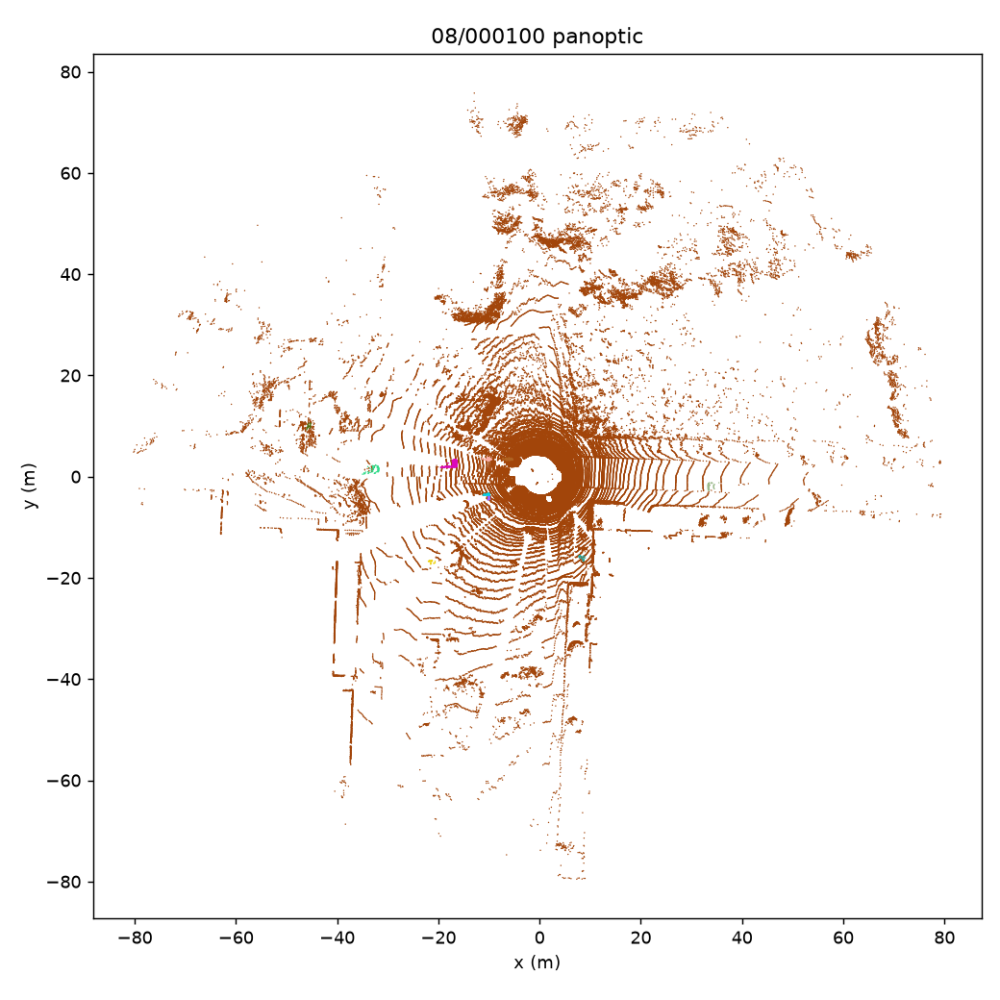
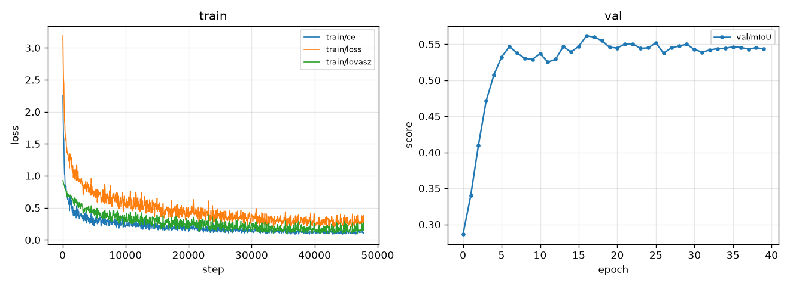

# 희소 포인트클라우드 기반 Panoptic Segmentation (SemanticKITTI)

> 이미지·포인트클라우드 양쪽에서 다뤄온 visual perception 경험을 **완결된 3D LiDAR panoptic 시스템**으로
> 통합한 프로젝트다. 논문 재현을 넘어, semantic segmentation·instance grouping·sparse convolution·대규모
> 평가가 하나의 end-to-end perception 파이프라인으로 맞물리는 과정을 직접 구현하고 검증했다. 특정 modality에
> 갇힌 전문성이 아니라, **연구 아이디어를 작동하는 시스템으로 옮기는 확장 능력**을 보이는 데 목적이 있다.

sparse-voxel semantic 백본(spconv MinkUNet U-Net)에 **center + offset** instance 헤드를 더해 LiDAR
panoptic segmentation을 수행한다. 공식 **PQ / PQ† / SQ / RQ**와 **mIoU**로 평가한다.

<!-- DEMO: scripts.viz가 demo/를 만들면 여기에 결과 이미지:

-->

## Abstract
SemanticKITTI panoptic은 점별 semantic class(19+ignore)와 8개 *thing* 클래스의 instance id를 함께
예측하는 문제다. 본 구현은 semantic 백본을 먼저 재현한 뒤, 같은 백본에 **점별 instance 중심으로의 3D
offset**과 **center heatmap**을 예측하는 두 헤드를 얹는다. 추론 시 thing 점을 예측 offset만큼 이동시켜
중심으로 모은 뒤 클래스별 DBSCAN으로 instance를 만든다(bottom-up, Panoptic-DeepLab / DS-Net 계열).
center+offset을 택한 이유는 희소 포인트에서 embedding+MeanShift보다 회귀 타깃이 조밀·안정적이기
때문이며, 임베딩 방식은 ablation(A1)으로 직접 비교한다. PQ는 직접 구현하지 않고 공식 evaluator를 감싼다.

## Method
```
points (x,y,z,remission) → voxelize(0.05 m) → spconv MinkUNet U-Net → 점별 feature
  ├ Semantic head → class logits   [CE + Lovász]
  ├ Center head   → centerness     [MSE]
  └ Offset head   → 3D offset       [L1, thing 점만]
→ thing 점을 offset만큼 이동 → 클래스별 DBSCAN → instance → panoptic merge
```
타깃·손실·그룹핑·merge의 정확한 수식은 [`DESIGN.md`](DESIGN.md) §2.1, 평가 수식은 §4.

## Results (val seq 08)
**실험 설정**: train 시퀀스 00–07,09,10 (전체) · voxel 0.05 m · 40 epoch · batch 4 · fp32 · 범위 crop
[-50,-50,-4, 50,50,2] · **data augmentation 없음** · compact spconv MinkUNet (5.9M). 공개 baseline은
**재학습이 아니라 논문 공개 수치를 인용**한 값이라 직접 비교 대상이 아니다. 격차의 원인 해석은 아래 Discussion.

**진행형 기여 분해(progressive) — 각 헤드가 지표에 미치는 영향**

| 모델 | mIoU | PQ | PQ† | FPS(scans/s) |
|---|---|---|---|---|
| Semantic only | 54.8 | — | — | 18.4 (net) |
| + center/offset panoptic (full) | **57.1** | **45.2** | **50.7** | 29.9 net / 2.1 e2e |

instance 헤드를 추가하니 semantic mIoU가 오히려 54.8→**57.1**로 올랐다(멀티태스크 학습이 feature에 도움).
end-to-end FPS(2.1)는 network(29.9)보다 크게 낮은데, 원인은 DBSCAN clustering(스캔당 ~435 ms)이다.

**공개 baseline 비교 (val seq 08, 논문 인용치)**

| 방법 | PQ | PQ† | SQ | RQ | mIoU |
|---|---|---|---|---|---|
| Panoptic-PolarNet (CVPR'21) | 59.1 | 64.1 | 78.3 | 70.2 | 64.5 |
| DS-Net (CVPR'21) | 57.7 | 63.4 | 77.6 | 68.0 | 63.5 |
| KPConv + PV-RCNN | 51.7 | 57.4 | 78.9 | 63.1 | 63.1 |
| PointGroup | 46.1 | 54.0 | 74.6 | 56.6 | 55.7 |
| **Ours** (spconv MinkUNet + center/offset) | **45.2** | **50.7** | **74.3** | **54.9** | **57.1** |

DS-Net·Panoptic-PolarNet이 우리와 같은 bottom-up 계열이라 가장 가까운 비교 대상이다. (참고: 최신
Panoptic-PHNet test PQ 61.5.) 수치 출처는 아래 참고문헌.

### Oracle 디버깅 — PQ 오차를 semantic vs grouping으로 분해
구성 요소를 GT로 대체해 오차의 출처를 분리한다.

| 설정 | PQ | 무엇을 재나 |
|---|---|---|
| full (예측 semantic + 예측 grouping) | **45.2** | 실제 성능 |
| `oracle=semantic` (GT semantic + 우리 offset/DBSCAN) | **95.1** | grouping이 낼 수 있는 PQ 상한 |
| `oracle=instance` (예측 semantic + GT instance) | **46.7** | semantic이 허용하는 PQ 상한 |

**결론: grouping은 병목이 아니다. semantic이 상한이다.** GT 클래스를 주면 우리 offset+DBSCAN이 PQ **95.1**에
도달한다(+49.9) — grouping/offset은 사실상 해결됐다. 반대로 완벽한 grouping(GT instance)을 줘도 PQ는
45.2→**46.7**로 +1.5에 그친다. 즉 45.2 PQ의 대부분은 **semantic segmentation 품질**에 갇혀 있으며, 낮은
semantic 클래스가 그대로 낮은 PQ로 이어지는 per-class 관찰(motorcyclist·truck·bicycle)과 일치한다. 개선
투자는 clustering이 아니라 semantic(augmentation·capacity·클래스 균형)에 해야 한다.
```bash
python -m src.eval ckpt=<best.ckpt> task=panoptic oracle=semantic data.root=$DATA
python -m src.eval ckpt=<best.ckpt> task=panoptic oracle=instance data.root=$DATA
```

## Qualitative
`scripts/viz`가 semantic / instance / panoptic 렌더를 만든다. 데모 프레임과 GIF는 학습 후 여기에 추가한다.
<!--  -->

**학습 곡선** — train loss가 3.2→0.3으로 수렴하고, val mIoU는 ~6 epoch에 포화 후 40 epoch까지 평탄.


## Failure analysis
정성·정량 실패 모드를 [`docs/failure-analysis.md`](docs/failure-analysis.md)에 정리한다(학습 후 그림 포함).
관찰 예정 항목(가설):
- 인접한 사람들이 하나로 **merge** — offset이 두 중심 사이로 평균화될 때.
- **bicycle/bicyclist**의 offset이 불안정 — 얇고 점이 적어 중심 추정이 어려움.
- 작은 **traffic-sign**은 center heatmap이 약함 — 점 수가 적어 heatmap 신호가 낮음.

## Discussion

### Semantic (mIoU 54.8)
- **격차가 클래스별로 극단적으로 불균등하다.** 흔한 클래스는 이미 공개 수치급 — car 94.3, road 89.7,
  building 86.9, vegetation 87.4, bicyclist 81.4. 반면 희귀·소형 클래스가 mIoU를 끌어내린다 —
  motorcyclist **0.0**, other-ground **0.3**, bicycle **13.7**, parking 23.0. mIoU는 클래스 균등 평균이라
  이 몇 개가 8~9점을 잠식한다. 즉 공개 대비 ~9점 격차는 backbone이 전반적으로 약해서가 아니라 **소수
  희귀 클래스의 붕괴**에서 온다.
- **원인(근거 기반).** 이 런은 축소가 아니라 거의 풀 세팅(전체 train·voxel 0.05·40 epoch)이었다. 따라서
  격차는 epoch/voxel이 아니라 (1) **data augmentation 부재**(회전/스케일/flip/instance oversampling이
  없어 희귀 클래스가 학습되지 않음 — motorcyclist 0.0이 전형), (2) **compact 백본**(5.9M, SPVCNN/full
  MinkUNet보다 작음), (3) 클래스 균형 샘플링 없음 때문으로 본다.
- **학습 길이는 병목이 아니다.** val mIoU는 ~6 epoch에 포화되어 40 epoch까지 평탄하다(위 곡선). 즉 더
  긴 학습으로 격차가 줄지 않으며, 상한은 capacity/augmentation 쪽임을 뒷받침한다.
- **함의.** 흔한 클래스는 포화 상태라, augmentation + 희귀클래스 oversampling이 가장 큰 상승 여지다. 이는
  panoptic으로 직결된다 — bicycle/motorcyclist의 낮은 semantic이 해당 thing의 PQ를 상한에서 막을 것이며,
  `oracle=instance`로 "semantic이 병목"임을 수치로 확인할 예정.

### Panoptic (PQ 45.2)
- **멀티태스크가 semantic을 끌어올렸다.** instance 헤드를 더하니 mIoU가 54.8→57.1로 상승 — center/offset
  회귀가 backbone feature에 정규화처럼 작용해 semantic에도 이득.
- **병목은 마스크 품질이 아니라 검출이다.** SQ 74.3(매칭된 마스크는 준수)인데 **RQ 54.9**로 낮다 — 즉
  instance를 **놓치는(false negative)** 것이 PQ를 끌어내린다. per-class로 보면 낮은 semantic이 그대로
  낮은 PQ로 이어진다: motorcyclist(PQ 0.7), truck(7.6), other-vehicle(17.9), bicycle(14.3). 반대로
  semantic이 좋은 car(84.4)·person(64.4)·bicyclist(72.5)는 PQ도 높다. → **semantic이 thing PQ의 상한**.
- **clustering이 지연의 지배 요인.** network 33 ms/scan인데 DBSCAN이 **435 ms/scan** → end-to-end 2.1
  scans/s. 실시간엔 부적합하며, eps/grouping 최적화(ablation)나 학습형 grouping(DS-Net)이 필요한 지점.
- **oracle 분해로 병목 확정** — GT 클래스를 주면 PQ 45.2→**95.1**(+49.9, grouping은 거의 완벽), GT
  instance를 줘도 45.2→**46.7**(+1.5뿐). 즉 **병목은 grouping이 아니라 semantic**이다(아래 Oracle 표).
  개선 여지는 clustering이 아니라 semantic(augmentation·capacity·클래스 균형)에 있다.

## Ablations
가설을 사전 등록하고 결과를 채운다 — [`ablations.md`](ablations.md). config 플래그로 실행:
`loss.offset=0` / `loss.center=0`(손실 기여), `cluster.eps=…`(추론만, 재학습 불필요), `data.voxel=0.10`,
`model.cr=0.5`.

## 직접 구현한 것 vs 가져다 쓴 것
직접 작성: SemanticKITTI 데이터셋·label remap·범위 crop·voxelize/collate(`src/data/`), spconv MinkUNet
U-Net(`src/models/backbone.py`), semantic·instance 타깃/손실(`src/lit_module.py`), offset-shift DBSCAN
(`src/panoptic/cluster.py`), 공식 evaluator를 감싼 PQ 어댑터(`src/panoptic/pq.py`), per-class 테이블+FPS
평가, Open3D viz, Hydra/Lightning/Docker.
가져다 쓴 것: spconv(sparse conv 커널), PRBonn `PanopticEval`(PQ 수식, vendor), 아키텍처 패턴
(Panoptic-DeepLab / DS-Net, MinkUNet), SemanticKITTI `learning_map`.

## 엔지니어링 노트
실제 LiDAR·batch>1로 규모를 올릴 때의 함정 정리 — [`docs/engineering-notes.md`](docs/engineering-notes.md)
(int32 좌표 flatten 한계, 좌표 열 순서 규약, spconv sm_86 SIGFPE, clean-clone 재현성 등).

## 재현
학습은 대여 클라우드 GPU(24GB+, ~170GB 디스크). spconv는 프리빌트 휠(소스 빌드 없음).
```bash
# 환경: docker build -f docker/Dockerfile -t panoptic .   또는   bash scripts/setup_cloud.sh
bash scripts/download_semantickitti.sh /data/semantickitti     # ~80GB
DATA=/data/semantickitti/dataset
python -m src.train task=semantic model=minkunet data.root=$DATA        # GATE 1
python -m src.train task=panoptic  model=minkunet data.root=$DATA       # GATE 2 (PQ는 eval에서 계산)
wget -O src/panoptic/eval_np.py \
  https://raw.githubusercontent.com/PRBonn/semantic-kitti-api/master/auxiliary/eval_np.py   # 공식 PQ evaluator
python -m src.eval  ckpt=<best.ckpt> task=panoptic data.root=$DATA      # PQ/mIoU + per-class + FPS
python -m scripts.viz ckpt=<best.ckpt> viz.frame=000100 viz.save=demo/ data.root=$DATA
# GPU/데이터 없이: PYTHONPATH=. python -m scripts.smoke_test
# 축소 설정: data.voxel=0.10 trainer.max_epochs=15 trainer.limit_train_batches=0.5
```

## 구조 · 계획
```
configs/  src/{data,models,panoptic,viz}  scripts/  docs/  DESIGN.md  ablations.md
```
빌드 순서와 go/no-go gate는 [`TASKS.md`](TASKS.md), 시간축/멀티뷰 확장 설계는
[`docs/consistency-4d.md`](docs/consistency-4d.md).

## 참고문헌 (비교 수치 출처)
- Panoptic-PolarNet, CVPR 2021 — [arXiv:2103.14962](https://arxiv.org/abs/2103.14962)
- DS-Net (Dynamic Shifting Network), CVPR 2021 — [arXiv:2011.11964](https://arxiv.org/abs/2011.11964)
- Panoptic-PHNet, CVPR 2022 — [arXiv:2205.07002](https://arxiv.org/abs/2205.07002)
